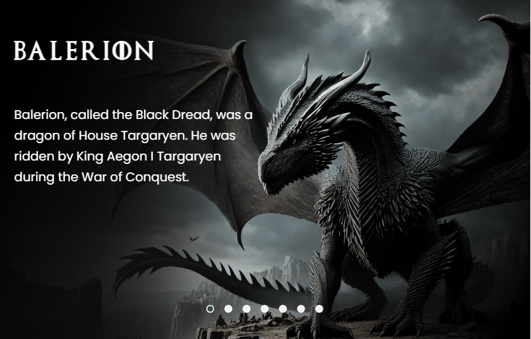

# House-of-the-Dragon
#### Project house of the dragon

## Technologies used

- HTML 
- CSS 
- JS

## What I learned from this project
 
 With this project I improved my knowledge with Javascript, mainly in creating a "carousel", where I was able to better understand this functionality.

 # Social media

 - 👋🏾 [Linkedin](https://www.linkedin.com/in/matheus17martins/)
 - 💻 [Github](https://github.com/ma17martins)

